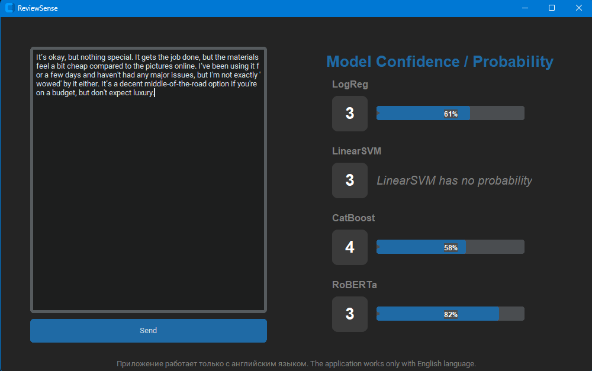

# ReviewSense

ReviewSense is a desktop application for **sentiment analysis and review rating prediction** built with multiple machine learning and deep learning models.

The application analyzes English reviews and predicts a rating from **1 to 5 stars** using several independent models:

- Logistic Regression
- Linear SVM
- CatBoost
- RoBERTa Transformer

The project also includes a complete preprocessing and training pipeline for all models.

---

# Features

## Implemented Functionality

### Text Preprocessing
- Cleaning URLs and unwanted symbols
- Lowercasing
- Lemmatization with spaCy
- Stopword removal
- Duplicate and empty row filtering
- Feature engineering:
  - token count
  - character count

### Machine Learning Models
- TF-IDF + Logistic Regression
- TF-IDF + Linear SVM
- CatBoost with native text features
- RoBERTa transformer fine-tuning

### Evaluation
- Accuracy
- Macro F1-score
- Classification reports
- Confusion matrices
- Training time tracking

### GUI Application
- Desktop interface built with CustomTkinter
- Probability/confidence visualization
- Multi-model comparison

---

# Project Structure

```text
project/
│
├── data/                     # Raw dataset (.jsonl)
├── output/                   # Processed datasets and statistics
├── artifacts/                # Saved models and vectorizers
├── src/
│    ├── preprocessing.py          # Dataset preprocessing
│    ├── vectorize.py              # TF-IDF vectorization
│    ├── train_baseline.py         # Logistic Regression training
│    ├── svm.py                    # Linear SVM training
│    ├── catBoost.py               # CatBoost training
│    ├── roberta_preprocess.py     # Dataset preparation for RoBERTa
│    ├── train_roberta.py          # RoBERTa fine-tuning
│    ├── gui.py                    # Desktop application
│
└── requirements.txt
```

---

# Models Overview

## Logistic Regression
Classic baseline model trained on TF-IDF features.

### Features
- Balanced class weights
- TF-IDF bigrams
- Word importance analysis

---

## Linear SVM
Linear Support Vector Machine trained on TF-IDF vectors.

### Features
- Balanced classes
- Optimized regularization
- Strong baseline for text classification

---

## CatBoost
Gradient boosting model using native text processing.

### Features
- GPU training support
- Built-in text embeddings
- Naive Bayes + Bag-of-Words feature calcers
- Automatic class balancing

---

## RoBERTa
Transformer-based deep learning model fine-tuned for 5-class sentiment classification.

### Features
- HuggingFace Transformers
- Mixed precision training (FP16)
- Macro F1 optimization
- Dynamic padding

---

# GUI Preview

## Interface Screenshot





---

# Installation

## 1. Clone Repository

```bash
git clone https://github.com/shedoesacase/ReviewSense.git
cd ReviewSense
```

---

## 2. Create Virtual Environment

### Windows

```bash
python -m venv venv
venv\Scripts\activate
```

### Linux / macOS

```bash
python3 -m venv venv
source venv/bin/activate
```

---

## 3. Install Dependencies

```bash
pip install -r requirements.txt
```

---

## 4. Download spaCy Model

```bash
python -m spacy download en_core_web_sm
```

---

# Dataset Format

The project expects a `.jsonl` dataset with the following structure:

```json
{
  "rating": 5,
  "text": "Amazing product, highly recommended!"
}
```

Place dataset file inside:

```text
data/
```

---

# Full Pipeline

## Step 1 — Preprocess Dataset

```bash
python preprocessing.py
```

Creates:
- cleaned dataset
- statistics
- plots

Output:
```text
output/processed_reviews.csv
```

---

## Step 2 — TF-IDF Vectorization

```bash
python vectorize.py
```

Creates:
- TF-IDF vectorizer
- train/test matrices

---

## Step 3 — Train Logistic Regression

```bash
python train_baseline.py
```

Artifacts:
- model
- reports
- confusion matrix

---

## Step 4 — Train Linear SVM

```bash
python svm.py
```

---

## Step 5 — Train CatBoost

```bash
python catBoost.py
```

Requirements:
- CUDA-compatible GPU recommended

---

## Step 6 — Prepare Dataset for RoBERTa

```bash
python roberta_preprocess.py
```

Creates tokenized dataset.

---

## Step 7 — Train RoBERTa

```bash
python train_roberta.py
```

Saves fine-tuned transformer model.

---

# Running the Application

After training all models:

```bash
python gui.py
```

---

# Interface Description

The application allows users to:

- Enter an English review
- Run inference through all models simultaneously
- Compare predictions
- Compare confidence scores

---


# Technologies Used

## Machine Learning
- Scikit-learn
- CatBoost
- HuggingFace Transformers

## NLP
- spaCy

## GUI
- CustomTkinter

## Visualization
- Matplotlib
- Seaborn

---

# Requirements

Recommended:
- Python 3.10+
- CUDA GPU for CatBoost and RoBERTa
- 16GB RAM

---
